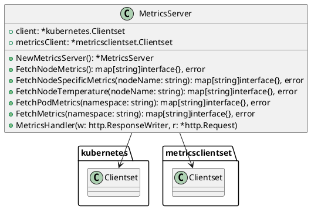

# K8sPulse

K8sPulse is a Kubernetes metrics server that provides detailed metrics about your Kubernetes cluster, including CPU, memory, storage, temperature, and traffic metrics for nodes and pods.

## Features

- Fetch node metrics (CPU, RAM, Storage, Temperature, Traffic)
- Fetch pod metrics (CPU, RAM Usage)
- Fetch node-specific metrics and pods
- Fetch node temperature metrics

## Installation

1. Clone the repository:
    ```sh
    git clone https://github.com/tjens23/K8sPulse.git
    cd K8sPulse
    ```

2. Build the project:
    ```sh
    go build -o K8sPulse main.go
    ```

3. Run the server:
    ```sh
    ./K8sPulse
    ```

## Usage

The metrics server runs on port `8080` by default. You can access the metrics using the following endpoints:

- `/metrics/` - Fetch metrics for all namespaces
- `/metrics/<namespace>` - Fetch metrics for a specific namespace
- `/metrics/node/<node name>` - Fetch metrics for a specific node
- `/metrics/node/<node name>/temperature` - Fetch temperature metrics for a specific node

## UML Diagrams

### Class Diagram


```plantuml
@startuml
actor User
participant "MetricsServer" as MS
participant "kubernetes.Clientset" as KCS
participant "metricsclientset.Clientset" as MCS

User -> MS: GET /metrics/
MS -> KCS: List Nodes
KCS --> MS: Nodes List
MS -> MCS: List PodMetricses
MCS --> MS: PodMetricses List
MS -> User: JSON Response

User -> MS: GET /metrics/node/<node name>
MS -> KCS: Get Node
KCS --> MS: Node
MS -> KCS: List Pods
KCS --> MS: Pods List
MS -> User: JSON Response

User -> MS: GET /metrics/node/<node name>/temperature
MS -> Node Exporter: Get Temperature Metrics
Node Exporter --> MS: Temperature Metrics
MS -> User: JSON Response
@enduml
```
License
This project is licensed under the MIT License - see the LICENSE file for details.

Contributing
Contributions are welcome! Please open an issue or submit a pull request.

Contact
For any questions or suggestions, please contact tjens23@student.sdu.dk or BitOfABye on discord.